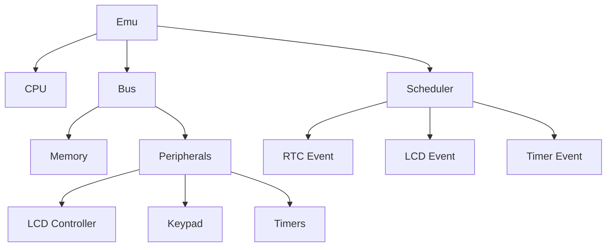

The `Emu` struct is the main emulator orchestrator that coordinates the CPU, bus, and peripherals to run the TI-84 Plus CE. It provides the high-level API for running the emulator and managing state.

## Overview

The `Emu` struct is defined in `core/src/emu.rs` and contains:

```rust
pub struct Emu {
    cpu: Cpu,                  // eZ80 CPU
    bus: Bus,                  // System bus (memory, I/O)
    scheduler: Scheduler,      // Event scheduler
    framebuffer: Vec<u32>,     // ARGB8888 framebuffer
    rom_loaded: bool,          // ROM loaded flag
    powered_on: bool,          // Calculator powered on
    history: ExecutionHistory, // PC/opcode history for diagnostics
    total_cycles: u64,         // Total cycles executed
    // ... internal state
}
```

## Creating an Emulator

### Rust API

```rust
use ti84ce_core::Emu;

let mut emu = Emu::new();
```

### C API

```c
#include "emu.h"

void* emu = emu_create();
// ... use emulator
emu_destroy(emu);
```

The C API uses `SyncEmu`, a thread-safe wrapper that contains a `Mutex<Emu>`. All FFI operations are synchronized to prevent data races.

## Loading ROM

Before running the emulator, you must load a TI-84 Plus CE ROM:

<CodeGroup>
```rust Rust
use std::fs;

let rom_data = fs::read("TI-84 CE.rom")?;
emu.load_rom(&rom_data)?;
```

```c C
FILE* f = fopen("TI-84 CE.rom", "rb");
fseek(f, 0, SEEK_END);
size_t len = ftell(f);
fseek(f, 0, SEEK_SET);
uint8_t* rom = malloc(len);
fread(rom, 1, len, f);
fclose(f);

int result = emu_load_rom(emu, rom, len);
free(rom);

if (result < 0) {
    // Error: -2 = empty ROM, -3 = ROM too large
}
```
</CodeGroup>

### ROM Requirements

- **Size**: Up to 4MB (0x400000 bytes)
- **Format**: Raw binary dump from TI-84 Plus CE
- **Source**: Extracted from calculator or official TI OS

<Warning>
The ROM is copyrighted by Texas Instruments and cannot be redistributed. Users must extract their own ROM from their calculator.
</Warning>

## Powering On

After loading the ROM, power on the calculator:

<CodeGroup>
```rust Rust
emu.power_on();
```

```c C
emu_power_on(emu);
```
</CodeGroup>

This simulates pressing the ON key. The CPU begins executing at PC=0x000000.

## Running Cycles

The main emulation loop runs a specified number of CPU cycles:

<CodeGroup>
```rust Rust
// Run 1 frame worth of cycles (48MHz / 60fps = 800000 cycles)
let executed = emu.run_cycles(800_000);
println!("Executed {} cycles", executed);
```

```c C
// Run 1 frame worth of cycles
int executed = emu_run_cycles(emu, 800000);
printf("Executed %d cycles\n", executed);
```
</CodeGroup>

### Cycle Counting

The emulator returns the actual number of cycles executed, which may differ from the requested amount due to:
- **HALT instruction**: CPU stops until interrupt or key press
- **Device power off**: User pressed 2nd+ON or OS triggered APD
- **Breakpoint hit**: Debug breakpoint reached (Rust API only)

### Frame Timing

For 60 FPS emulation at 48 MHz:

```rust
const FRAME_CYCLES: u32 = 48_000_000 / 60; // 800,000 cycles/frame

loop {
    let start = Instant::now();
    emu.run_cycles(FRAME_CYCLES);
    emu.render_frame(); // Update framebuffer
    
    let elapsed = start.elapsed();
    if elapsed < Duration::from_millis(16) {
        thread::sleep(Duration::from_millis(16) - elapsed);
    }
}
```

## Framebuffer Access

The emulator maintains a 320×240 ARGB8888 framebuffer:

<CodeGroup>
```rust Rust
emu.render_frame(); // Update framebuffer from VRAM
let (width, height) = emu.framebuffer_size(); // (320, 240)
let pixels = emu.framebuffer(); // &[u32]

// Each pixel is 0xAARRGGBB
for y in 0..height {
    for x in 0..width {
        let pixel = pixels[y * width + x];
        let r = ((pixel >> 16) & 0xFF) as u8;
        let g = ((pixel >> 8) & 0xFF) as u8;
        let b = (pixel & 0xFF) as u8;
        // Render pixel...
    }
}
```

```c C
int width, height;
const uint32_t* fb = emu_framebuffer(emu, &width, &height);
// width = 320, height = 240

// Each pixel is 0xAARRGGBB (ARGB8888)
for (int y = 0; y < height; y++) {
    for (int x = 0; x < width; x++) {
        uint32_t pixel = fb[y * width + x];
        uint8_t r = (pixel >> 16) & 0xFF;
        uint8_t g = (pixel >> 8) & 0xFF;
        uint8_t b = pixel & 0xFF;
        // Render pixel...
    }
}
```
</CodeGroup>

<Note>
The framebuffer is updated by calling `render_frame()` (Rust) or automatically during `emu_run_cycles()` (C API).
</Note>

## Key Input

The keypad is an 8×8 matrix. Press/release keys with:

<CodeGroup>
```rust Rust
// Press ENTER key (row 6, col 1)
emu.set_key(6, 1, true);

// Release ENTER key
emu.set_key(6, 1, false);
```

```c C
// Press ENTER key (row 6, col 1)
emu_set_key(emu, 6, 1, 1);

// Release ENTER key
emu_set_key(emu, 6, 1, 0);
```
</CodeGroup>

### Key Matrix Layout

The 8×8 key matrix maps to physical keys:

| Row | Col 0 | Col 1 | Col 2 | Col 3 | Col 4 | Col 5 | Col 6 | Col 7 |
|-----|-------|-------|-------|-------|-------|-------|-------|-------|
| 0   | Graph | Trace | Zoom  | Wind  | Y=    | 2nd   | Mode  | Del   |
| 1   | Sto   | Ln    | Log   | x²    | x⁻¹   | Math  | Alpha | —     |
| 2   | 0     | 1     | 4     | 7     | ,     | Sin   | Apps  | X,T,θ |
| 3   | .     | 2     | 5     | 8     | (     | Cos   | Prgm  | Stat  |
| 4   | (-)   | 3     | 6     | 9     | )     | Tan   | Vars  | —     |
| 5   | Enter | +     | -     | ×     | ÷     | ^     | Clear | —     |
| 6   | Down  | Left  | Right | Up    | —     | —     | —     | —     |
| 7   | —     | —     | —     | —     | —     | —     | —     | —     |

<Info>
Row/column indices are **zero-based**. For example, the ENTER key is at row 5, column 0 (not row 6, column 1 as shown in some diagrams).
</Info>

## State Management

### Save State

<CodeGroup>
```rust Rust
let size = emu.save_state_size();
let mut buffer = vec![0u8; size];
emu.save_state(&mut buffer)?;

std::fs::write("state.sav", &buffer)?;
```

```c C
size_t size = emu_save_state_size(emu);
uint8_t* buffer = malloc(size);
int result = emu_save_state(emu, buffer, size);

if (result > 0) {
    // Write buffer to file
    FILE* f = fopen("state.sav", "wb");
    fwrite(buffer, 1, result, f);
    fclose(f);
}
free(buffer);
```
</CodeGroup>

### Load State

<CodeGroup>
```rust Rust
let data = std::fs::read("state.sav")?;
emu.load_state(&data)?;
```

```c C
FILE* f = fopen("state.sav", "rb");
fseek(f, 0, SEEK_END);
size_t len = ftell(f);
fseek(f, 0, SEEK_SET);
uint8_t* data = malloc(len);
fread(data, 1, len, f);
fclose(f);

int result = emu_load_state(emu, data, len);
free(data);

if (result < 0) {
    // Error: -1 = null pointer, -105 = invalid state
}
```
</CodeGroup>

## Sending Files

You can send .8xp (programs) and .8xv (variables) files to the emulator:

<CodeGroup>
```rust Rust
let file_data = std::fs::read("program.8xp")?;
let count = emu.send_file(&file_data)?;
println!("Injected {} entries", count);
```

```c C
FILE* f = fopen("program.8xp", "rb");
fseek(f, 0, SEEK_END);
size_t len = ftell(f);
fseek(f, 0, SEEK_SET);
uint8_t* data = malloc(len);
fread(data, 1, len, f);
fclose(f);

int result = emu_send_file(emu, data, len);
free(data);

if (result < 0) {
    // Error: -10 = ROM not loaded, -11 = parse error,
    //        -12 = no flash space, -13 = already booted
}
```
</CodeGroup>

<Note>
Files must be sent **after** `load_rom()` but **before** `power_on()`. The emulator injects them into the flash archive so TI-OS discovers them on boot.
</Note>

## LCD State

Query LCD state for accurate display rendering:

<CodeGroup>
```rust Rust
let backlight = emu.get_backlight(); // 0-255
let lcd_on = emu.is_lcd_on();

if lcd_on {
    // Render framebuffer with backlight brightness
} else {
    // Display is off, show black screen
}
```

```c C
uint8_t backlight = emu_get_backlight(emu); // 0-255
int lcd_on = emu_is_lcd_on(emu); // 1 = on, 0 = off

if (lcd_on) {
    // Render framebuffer with backlight brightness
} else {
    // Display is off, show black screen
}
```
</CodeGroup>

## Public Methods

### Core Methods

```rust
impl Emu {
    pub fn new() -> Self;
    pub fn reset(&mut self);
    pub fn load_rom(&mut self, data: &[u8]) -> Result<(), i32>;
    pub fn power_on(&mut self);
    pub fn run_cycles(&mut self, cycles: u32) -> u32;
}
```

### Display Methods

```rust
impl Emu {
    pub fn render_frame(&mut self);
    pub fn framebuffer(&self) -> &[u32];
    pub fn framebuffer_size(&self) -> (usize, usize);
    pub fn get_backlight(&self) -> u8;
    pub fn is_lcd_on(&self) -> bool;
}
```

### Input Methods

```rust
impl Emu {
    pub fn set_key(&mut self, row: usize, col: usize, down: bool);
}
```

### State Methods

```rust
impl Emu {
    pub fn save_state_size(&self) -> usize;
    pub fn save_state(&self, buffer: &mut [u8]) -> Result<usize, i32>;
    pub fn load_state(&mut self, data: &[u8]) -> Result<(), i32>;
}
```

### File Transfer Methods

```rust
impl Emu {
    pub fn send_file(&mut self, file_data: &[u8]) -> Result<usize, i32>;
    pub fn send_file_live(&mut self, file_data: &[u8]) -> Result<usize, i32>;
}
```

## Internal Architecture

The `Emu` struct orchestrates several subsystems:



### Execution Flow

1. **Fetch**: CPU reads instruction from memory via bus
2. **Decode**: CPU decodes opcode and determines operation
3. **Execute**: CPU performs operation, updating registers/memory
4. **Tick**: Peripherals advance by elapsed cycles
5. **Schedule**: Check for pending events (LCD refresh, timer overflow, etc.)
6. **Interrupt**: Check for pending interrupts and handle if enabled

## Next Steps

<CardGroup cols={2}>
  <Card title="Memory Types" icon="memory" href="/api/memory">
    Learn about Flash, RAM, and memory map
  </Card>
  <Card title="CPU Module" icon="cpu" href="/api/cpu-module">
    Explore the eZ80 CPU implementation
  </Card>
  <Card title="Peripherals" icon="keyboard" href="/api/peripherals">
    Understand peripheral controllers
  </Card>
  <Card title="Testing" icon="vial" href="/development/testing">
    Test the emulator with boot/trace tools
  </Card>
</CardGroup>
